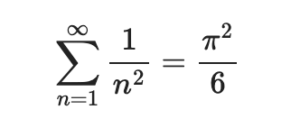
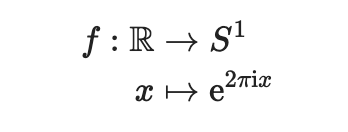
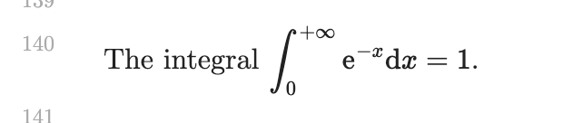
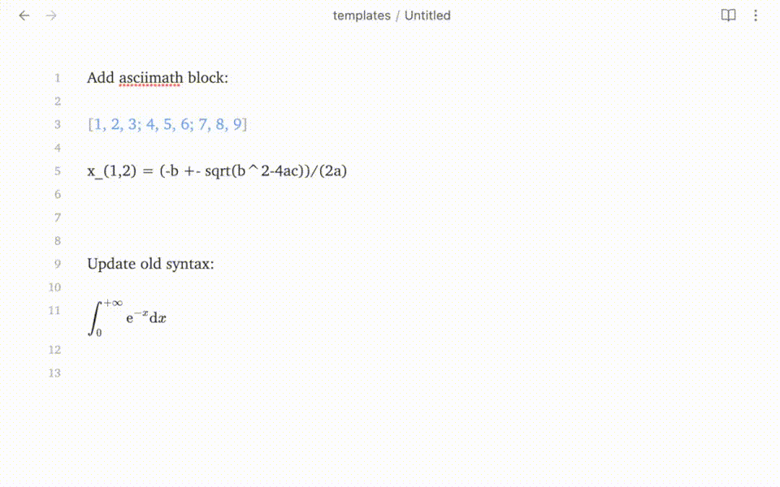

# Obsidian Asciimath

**WARNING** This plugin does not support inline formula very well.

## Install

- (Pending, currently not available) Goto Obsidian plugin market, search for `obsidian-asciimath` and install it.
- (Manually) Goto the [release page](https://github.com/widcardw/obsidian-asciimath/releases), download the zip, unzip it and add it to your plugins folder.

## Usage

With the default config, you can write math formulas with the syntax of [asciimath](asciimath.org).

For more infomation about asciimath, please refer to [asciimath.org](http://asciimath.org) and [zmx0142857's note (in Chinese)](https://zmx0142857.github.io/note/).

#### Code block

~~~text
```am (or asciimath)
sum _(n=1) ^oo 1/n^2 = pi^2/6
```
~~~



Multiline formula alignment (Specially thanks to [asciimath-js](https://github.com/zmx0142857/asciimathml))

~~~text
```am
f: RR & -> S^1
                         <-- a blank line here
x & |-> "e"^(2pi "i" x)
```
~~~



> asciimath is easy and simple, while in LaTeX, you should write the long formula with so many backslashes.
> ```tex
> \begin{aligned}
> f: \mathbb{R} & \to S^{1} \\
> x & \mapsto \mathrm{e}^{2 \pi \mathrm{i} x }
> \end{aligned}
> ```

#### Inline asciimath

The inline formula should be wrapped with \`\$ and \$\`, that is, you should input the formula like

```text
The integral `$int _0^(+oo) "e"^-x dx = 1$`.
```



## Configuration

You can add other prefix alias of code block in the settings. The default values are `asciimath` and `am`.

Inline formula **can only** be wrapped with special escapes. Just look at the examples below.

```diff
- start: ``   !!! invalid !!!
- end:   ``   !!! invalid !!!

- start: `    !!! invalid !!!
- end:   `    !!! invalid !!!

+ start: `$   √√√  valid  √√√  // default
+ end:   $`   √√√  valid  √√√  // default

+ start: `*   √√√  valid  √√√
+ end:   *`   √√√  valid  √√√

+ start: `{   √√√  valid  √√√
+ end:   }`   √√√  valid  √√√

+ start: `[   √√√  valid  √√√
+ end:   ]`   √√√  valid  √√√

(... any other valid escapes ...)
```

After changing the settings, **DONT FORGET to hit the "Save" button**.

## Commands



#### Insert asciimath codeblock

#### Convert asciimath into mathjax in current file

## Development

```sh
git clone git@github.com:widcardw/obsidian-asciimath.git
pnpm i
pnpm run dev
```
